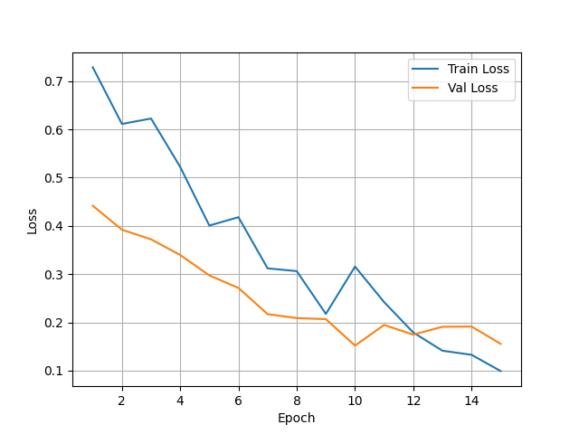
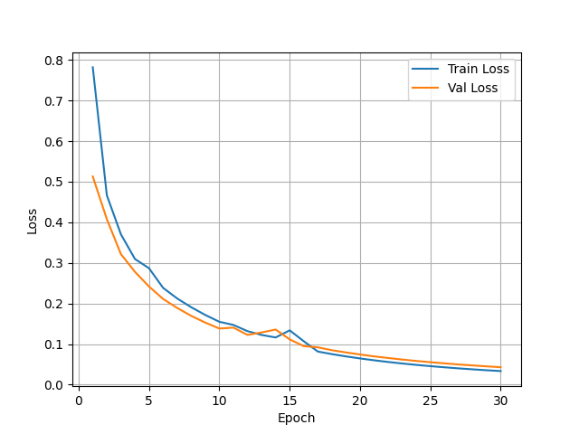
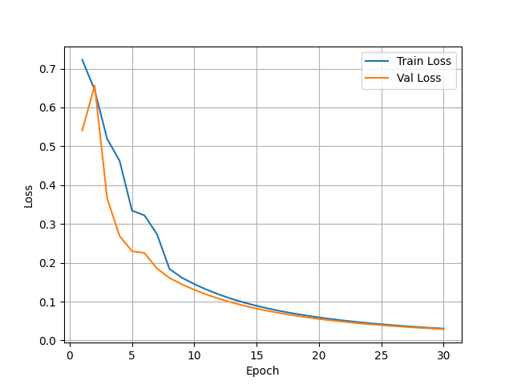

# DINOv2 Image Classification Pipeline with triplet loss

A modular, production-ready PyTorch pipeline for image classification using DINOv2 as a backbone, with optional triplet loss for metric learning.

---

## Project Overview

This pipeline combines classification and embedding learning. The model learns to:

- Classify images into predefined categories via cross-entropy loss.  
- Learn a compact embedding space where images of the same class are pulled together and different classes are pushed apart, via triplet loss.  
- Adapt high-level semantic features to the target dataset by unfreezing the last transformer blocks of DINOv2, improving task-specific representation and overall accuracy.

Triplet loss is particularly useful when the visual differences between classes are subtle, or when you later want to use the embeddings for similarity search or retrieval.

---

## Project Structure

```
README.md
dataset/
config/
    config.json         - All training and model hyperparameters
utils/
    config_parser.py    - Loads, validates, and exposes config as a Python object
model/
    backbone.py         - DINOv2-based model with embedding and classifier heads
tools/
    trainer.py          - Full training loop with logging, early stopping, and curve plots
    infer.py            - Run inference on a single image or a folder
```

---

## Loss Functions

### Cross Entropy Loss
Standard classification loss. Trains the model to output correct class probabilities. Always active.

### Hard Triplet Loss
```
L = max(0, d(A, P) - d(A, N) + margin)
```
Enforces a strict margin between the anchor-positive distance and anchor-negative distance. If the margin is already satisfied, the loss is zero. Works well on clean, well-labeled datasets.

### Soft Triplet Loss
```
L = log(1 + exp(d(A, P) - d(A, N)))
```
A smooth version of triplet loss. The loss never drops to exactly zero, which provides continuous gradient signal. More stable to train, recommended for noisy or imbalanced datasets.

### When to Use What
- Use soft triplet loss when your dataset has label noise or class imbalance (recommended as default).
- Use hard triplet loss when your dataset is clean and you want strict class separation.
- Set both to false to train with only cross-entropy loss.

### Total Loss
```
Total Loss = CrossEntropy + (triplet_weight * TripletLoss)
```

---

## Configuration

Edit `config.json` before training:

```json
{
    "train_dir": "/path/to/train",
    "val_dir": "/path/to/val",
    "class_names": ["CLASS_A", "CLASS_B", "CLASS_C", ......],
    "epochs": 30,
    "learning_rate": 1e-4,
    "batch_size": 32,
    "patience": 5,
    "optimizer": "adam",
    "result_dir": "./outputs",
    "use_hard_triplet_loss": false,
    "use_soft_triplet_loss": true,
    "triplet_weight": 0.5,
    "model_name": "dinov2_vitb14",
    "model_repo": "facebookresearch/dinov2"
}
```

Notes:
- `optimizer` accepts only `"adam"` or `"adamw"`.
- Only one of `use_hard_triplet_loss` or `use_soft_triplet_loss` can be true at a time.
- If both are false, only cross-entropy is used.

---

## How to Run

### Train
```bash
python tools/trainer.py config/config.json
```

The `--save` flag writes results to `result_dir/inference_results.json`.

---

## Outputs

After training, the following are saved to `result_dir`:
- `best_model.pth` - Best model weights by validation loss
- `training_log.csv` - Per-epoch metrics
- `loss_curve.png` - Train and validation loss plot
- `accuracy_curve.png` - Train and validation accuracy plot

---

## Requirements

```
torch
torchvision
pytorch_metric_learning
tqdm
matplotlib
Pillow
```

Install with:
```bash
pip install torch torchvision pytorch_metric_learning tqdm matplotlib Pillow
```

## Training results on cctv camera based gender classification
- without triplet loss


- with soft triplet loss


- with hard triplet loss
